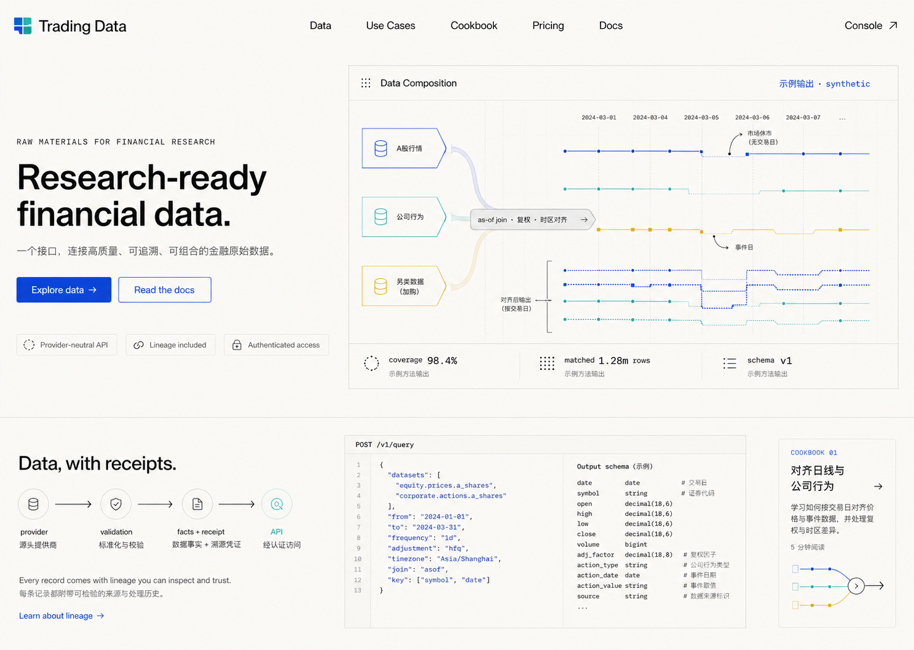
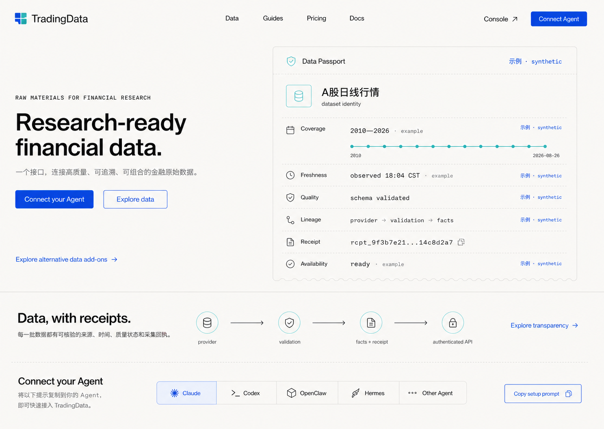
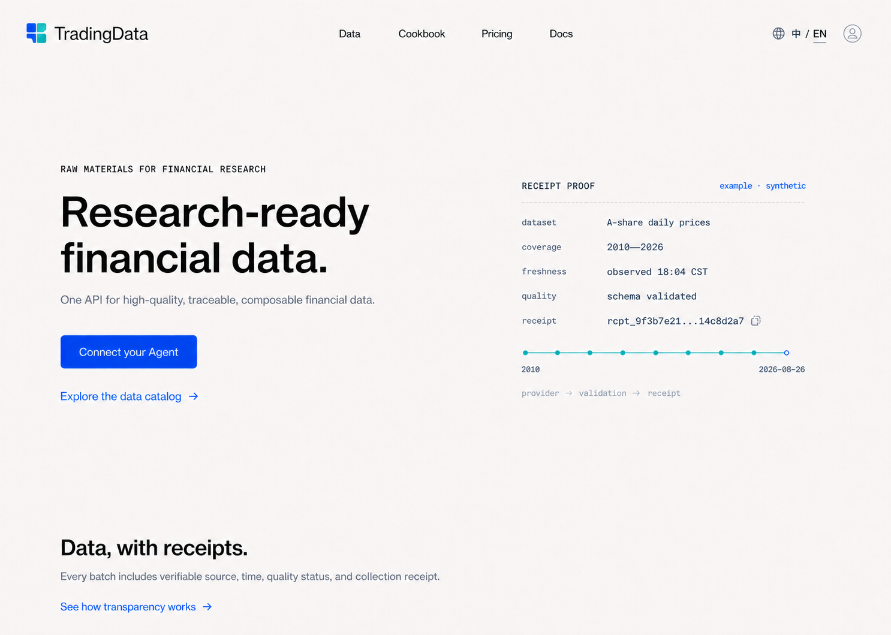
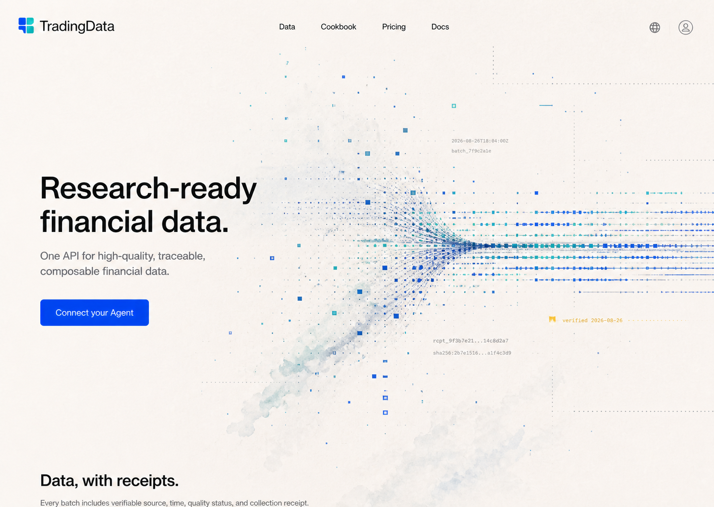

# TradingDatas public data product system v1

## 1. Purpose

This document freezes the visual system and original public product direction.
The current object/navigation contract is superseded by
`docs/product/PUBLIC_SURFACE_MAP.md`; the current-vs-target capability boundary
is defined in `docs/product/PRODUCT_PLANES.md`. Cookbook/Recipes now appears as
the preparation-method layer inside Research, while its direct detail routes
remain compatible.

This document freezes the public information architecture, content boundary,
visual direction, component contract, commerce states, and frontend acceptance
rules for TradingDatas.

TradingDatas supplies high-quality financial **raw material** through one
provider-neutral API. It may teach customers how to query, align, join, and
validate that material. It does not perform the customer's research, generate
opaque signals, publish strategy performance, or make trading decisions. A
future Feature Plane may deliver transparent, versioned derived data whose
formula, inputs, alignment, revision policy, tests, lineage, and limitations
are public.

The core promise is:

> Research-ready financial data, delivered through one API.

The supporting Chinese line is:

> 一个接口，提供可直接用于后续研究、量化和资产分析的高质量金融原始数据。

## 2. Product boundaries

### 2.1 What TradingDatas sells

- licensed or otherwise approved raw financial and alternative data;
- provider-native payload retained with mechanically verifiable normalization;
- stable dataset identity and schema;
- coverage, cadence, freshness, quality, receipt, and lineage evidence;
- authenticated catalog/query access with account limits;
- a small number of complete packages and separately entitled add-ons.

### 2.2 What TradingDatas teaches

- how to discover the correct dataset;
- how to build bounded catalog/query requests;
- how to align identifiers, trading dates, report periods, time zones, and
  as-of availability;
- how to join datasets without losing lineage;
- how to handle missing rows, revisions, suspensions, adjustment factors, and
  pagination;
- what output schema a correct preparation method produces;
- which additional raw datasets may improve coverage or context.

### 2.3 What TradingDatas does not do

- market research conclusions or editorial market calls;
- entity inference, sentiment, factors, prediction, alpha, or security ranking;
- backtest returns, win rate, strategy benchmark, recommendation, or signal;
- portfolio, risk, order, execution, or broker functions;
- self-awarded data-quality league tables presented as independent benchmarks.

## 3. Authority model

The website composes three authorities but never merges them:

| Plane | Authority | May show | Must not do |
| --- | --- | --- | --- |
| Data | registry + facts/receipts + catalog/query | dataset identity, coverage, freshness, quality, lineage, samples | invent availability or bypass the API |
| Account/commerce | authenticated account and future commerce service | package, grant, quota, expiry, trial, renewal, invoice, payment | infer access from a label or client state |
| Content | versioned Data/Features/Research/Methods/Docs/Account content | explanation, methods, Agent setup prompts, translated authored copy, synthetic/observed examples | activate data, grant access, write facts, publish research conclusions |

Marketing, content, and client-side state are never runtime evidence.

## 4. Public information architecture

### 4.1 Global navigation

1. **Data** — core and alternative dataset discovery, shared data template,
   receipt evidence, and alternative-data ordering explanation;
2. **Research** — externally authored papers, industry research, and cases,
   reorganized by TradingDatas' format/topic taxonomies with source attribution,
   a reading guide, related data materials, and progressively disclosed
   preparation methods;
3. **Pricing** — three request-rate tiers sharing the same base data; alternative-data
   commerce is a later independent surface and is not part of the main page.

The header is a compact floating rounded surface containing the three primary
destinations, one global search field, Bookmarks, and the Account icon. Its
desktop hierarchy stays single-layer: Data, Research, and Pricing are quiet
text links placed directly on the shared surface, with a fine current-location
underline instead of a nested segmented pill or filled active tab. Desktop
search uses a bounded responsive width so it remains prominent without taking
over the whole navigation surface. Brand and primary destinations stay grouped,
while flexible space separates search from saved/account actions. Homepage and
inner-page headers share one desktop top-edge offset. Global
search spans datasets, external research, preparation methods, and
documentation. Data, Research, the expanded research library, and Documentation
do not duplicate keyword search boxes; they retain only task-specific taxonomy
and status controls. On mobile, global search moves into the expanded floating
navigation. Documentation, language, appearance, Agent/MCP connection, access,
billing, and security live inside Account rather than as top-navigation items.
Bookmarks remain explicitly browser-local until authenticated sync exists.
Global results are grouped by Data, Research, Methods, and Docs and implement
combobox keyboard behavior: Arrow Up/Down changes the active result, Home/End
jumps to the first/last visible result, Enter opens it, and Escape closes the
surface. The complete result count is announced politely. Each group initially
shows four results and may expand in place, preserving a single search surface.
Up to five recent query strings may be kept in this browser only, with visible
per-item removal and clear-all actions; they are never account sync, analytics,
entitlement evidence, or server-side history.
Discovery matches both authored languages plus stable IDs, market, category,
cadence, and restrained Chinese/English/pinyin aliases. Ranking is deterministic:
exact labels and dataset IDs precede descriptive or synonym matches, explicit
Research/Methods/Docs intent may promote that group, and equal-score products
retain catalog order. This index remains static product-content projection, not
runtime availability, account entitlement, or behavioral profiling.
Latin-token typo recovery is intentionally narrow: one insertion, deletion,
substitution, or adjacent transposition, with a minimum token length of four.
Chinese text and short technical codes are never fuzzed. If no object matches,
the search surface presents three authored example queries; selecting one
replaces the query explicitly rather than broadening it invisibly.
`Command/Ctrl + K` focuses the single global search; on mobile it first opens
the floating navigation. Results explain only otherwise invisible match paths:
stable ID, authored alias, or bounded approximate match. Direct title and
description matches remain visually quiet.

Each primary navigation item resolves to an independent, directly addressable
page with its own task depth. The homepage remains a focused value proposition;
it does not substitute a long stack of anchor-linked product sections for those
pages.

`Research` may be a primary navigation item only for a clearly attributed
external-literature database. It must not imply that TradingDatas authored or
endorsed a paper's conclusions. Do not use `Benchmark` as a primary navigation
item or independently rank TradingDatas' own product.

### 4.2 Proposed route map

The paths below are a design contract, not a claim that they are implemented.

```text
/
/data
/datasets/:datasetId
/data/alternative
/data/receipts
/features
/features/:featureId
/features/methodology
/research
/research/:paperSlug
/recipes
/recipes/:slug
/pricing
/pricing/preview          display-only selection; payment disabled
/pricing/alternative
/pricing/beta
/docs
/checkout                 future commerce plane
/account
/account/subscription     future account/commerce projection
/account/access
/account/usage
/account/api-keys
/account/agent-connections
/account/billing
/account/security
/account/preferences
/app/                     existing authenticated console
```

Public routing must not create provider-specific data endpoints. All examples
continue to use `GET /v1/catalog` and `POST /v1/query`.

### 4.3 Bilingual behavior

- supported locales: `zh-CN` and `en`;
- first visit follows `navigator.languages`/system locale; Chinese locales map
  to `zh-CN`, all others to `en`;
- the header exposes an accessible language switch in signed-in and signed-out
  states;
- a manual choice overrides system detection and persists locally; signed-in
  accounts may additionally persist it server-side;
- localize navigation, product copy, dates, numbers, currency, validation and
  accessibility labels;
- never translate dataset IDs, field names, API paths, schema values, receipt
  IDs, reason codes, or provider-native payloads;
- missing keys fall back to English per key and are reported during QA; no
  machine translation occurs at runtime.

## 5. Page contracts

### 5.1 Home

The home page explains one promise and demonstrates one real product action.
It is not a feature inventory.

Required sequence:

1. concise product statement, `Explore data` primary action, and a quieter
   `Connect Agent` secondary action;
2. one dominant receipt-backed Data Passport showing coverage, freshness,
   quality, lineage, receipt identity, observation time, and limitations;
3. a full-width `Data, with receipts` trust section that explains provider ->
   validation -> facts + receipt -> authenticated API and links to live,
   source-bound transparency details;
4. one quiet Agent/MCP connection link that enters the signed-in Account area;
5. Cookbook, packages, and alternative-data add-ons only after the trust and
   connection story is understood.

The first viewport has one visual focal point: the receipt-backed Data Passport.
Data Composition, query code, and Cookbook figures must not compete with it there.
Move Data Composition to dataset detail or Cookbook detail; move the full query
editor to Docs or Account/Agent Connections. Homepage previews may link to them
using one quiet row.

Avoid exchange terminals, candlesticks as decoration, red/green price theatre,
provider logos as the main hierarchy, and a grid of equal-weight pricing cards
above the product explanation.

### 5.2 Data catalog

The catalog helps users choose material, not permissions.

The catalog uses a strict two-level product taxonomy:

```text
data category -> individually packaged data product -> product detail
```

A category is a discovery and navigation layer, never a dataset or purchasable
object. For example, `Alternative data` is the category and `Pizza Index` is a
data product inside it. The same distinction applies to market data,
company/fundamentals, corporate events, indices/funds, macro/rates,
news/documents, global markets, and crypto assets. Every data product has its
own stable identity, display mark, contents, sample contract, cadence,
coverage/stability evidence, access boundary, and addressable detail page.

The public planning vocabulary is limited to three customer-readable stages:

- `Observed` / `已观测`: bounded observation evidence exists; any example-only
  evidence remains explicitly labelled and is not a public-access claim;
- `Planned` / `规划中`: collection has not started and the source/product
  contract remains on the roadmap;
- `Pending release` / `待开放`: the product is an active onboarding candidate
  but public purchase/query access has not opened.

Provider permission, source rights, receipt history, runtime readback, and
commercial entitlement stay visible inside the product detail instead of
becoming additional ambiguous catalog badges.

- search by customer language, dataset name, market, domain, cadence, and
  availability state;
- group by data family rather than upstream vendor;
- provide a clearly labelled `Alternative Data` category and filter, then list
  individual products such as `Pizza Index` beneath it;
- show concise coverage/cadence/lineage facts from catalog;
- distinguish `available`, `degraded`, `paused`, and `unobserved` without
  marketing euphemisms;
- make package/add-on requirements readable but never client-authoritative;
- preserve forward-only cursor behavior for actual sample data.

The Data landing page first answers four user questions in order: what material
exists, how datasets are classified, what the shared data template looks like,
and how alternative data is tried and ordered. The initial A-share presentation
uses four workload-readable families: market/reference, intraday/microstructure,
fundamentals/corporate actions, and indices/funds. Alternative data stays a
separate category. Its internal source or subject tags may cover activity,
mobility, hiring, app/web attention, supply chain, geospatial observations,
consumer pricing, and delayed regulatory holdings disclosures, but those tags
never replace the individual product identity.

Data-product marks use a softly blended, filled abstract mini-cover system.
Every category owns one stable color family and one base geometric grammar.
Products inside that category inherit both, then vary the arrangement via
direction, module order, density, crop, offset, mirroring, local scale, or a
restrained two-layer echo. The system supports at least eight repeatable
variants before an arrangement is reused. The result must read as one
recognizable family with distinct members. Status colors never recolor product
identity. The marks are identity assets, not literal finance icons, status
indicators, decorative emoji, or CSS-drawn approximations.

Every category base must be visually distinct in geometry as well as color;
changing only hue does not create a new category family. The current asset
families use bars for market data, a modular ledger for company/fundamentals,
concentric fields for events, segmented arcs for indices/funds, layered
contours for macro/rates, staggered streams for news/text, crossing fields for
alternative data, interlocking geographic fields for global markets, and a
calm faceted lattice for crypto assets.

Catalog maturity (`Observed`, `Planned`, `Pending release`) appears at the start
of the evidence area on focused lists and details. It must not sit beside the
product name as if it were part of product identity. Real stability percentage,
receipt window, cadence, and empty-history explanation follow beneath the
stage. Compact category shelves may place the stage at the bottom of the
preview because no evidence column is present.

The current public design-contract catalog plans 40 product objects across nine
categories. This is a roadmap projection, not runtime authority:

| Category | Planned product objects |
| --- | --- |
| Market data | A-share daily; historical minutes; auction/pre-market; market reference/adjustments; real-time snapshot |
| Company & fundamentals | point-in-time fundamentals; company master/industry; ownership/holdings; valuation/financial indicators |
| Corporate events | company actions; announcements; investor Q&A; IPO/listing calendar |
| Indices & funds | constituents/weights; ETF NAV/IOPV; fund portfolio disclosures; convertible bonds |
| Macro & rates | China macro calendar; rates/yield curves; central-bank operations; futures/commodity reference |
| News & documents | financial news/flashes; policy/regulation library; broker research; central-bank reports |
| Alternative data | Pizza Index; Foot Traffic Index; Hiring Activity Index; App Attention Index; Web Attention Index; Shipping Congestion Index; Night Lights Activity; Consumer Price Basket; Notable Investor 13F Holdings |
| Global markets | Hong Kong equity daily; US equity daily; SEC filings/XBRL; global macro indicators |
| Crypto assets | Binance spot 5-minute bars; Binance funding/open interest; Coinbase spot market |

The current prototype projection contains one explicitly bounded observed
example, six pending-release candidates, and 34 planned products. These labels
must be replaced by authenticated catalog/receipt/account evidence before any
production or commercial claim.

The catalog uses progressive disclosure to keep this heavy material readable.
Its default state is a lightweight directory of the nine categories, with up
to four representative products per category. A category, status, or search
selection opens the focused product list. Product samples, complete evidence,
schema, and limitations remain on the addressable product detail page. Products
without collection history show a concise empty-evidence state with cadence and
onboarding plan; they must not render decorative empty stability charts or
repeat pseudo-operational metrics. Stability trends appear only when bounded
observation evidence exists.

### 5.3 Dataset detail

This is the closest analogue to a model detail page on a unified API platform.

Required modules:

1. dataset identity, plain-language purpose, dataset ID, and schema major;
2. coverage and cadence visualization from current catalog projection;
3. field dictionary and sample rows;
4. quality, freshness, receipt, and lineage explanation;
5. bounded API example with copy action and no real token;
6. `Use with` relationships to other raw datasets;
7. related Cookbook methods;
8. package/add-on requirement and truthful availability;
9. limitations, revision/as-of caveats, and licensing notes.

The product-specific data contract and bounded query request are rendered
inline on this detail page. They are not separate Docs drill-down destinations.
The request remains copy-only and must tell the reader to confirm the
authoritative `dataset_id`, `schema_major`, and entitlement through
`GET /v1/catalog` and authenticated account evidence before use.

`Use with` is a relationship guide, not a precomputed joined dataset or a claim
of investment usefulness.

### 5.4 Research methods (Cookbook/Recipes compatibility layer)

A method entry starts with a customer preparation job and, when execution detail is
useful, continues into the reproducible preparation method. This combines the
previous Use Case and Cookbook destinations without losing either content type.

Examples:

- prepare a company-event timeline;
- prepare a point-in-time financial panel;
- prepare adjusted daily/minute observations;
- prepare an intraday observation stream;
- prepare policy/news/announcement evidence for downstream analysis.

Every executable Cookbook entry follows this durable template:

```text
Goal
Required datasets and entitlement
Input fields
Join keys and as-of/time-zone rules
Bounded catalog/query calls
Preparation steps
Expected output schema
Synthetic or explicitly bounded observed example
Validation checklist
Limitations and customer-owned next steps
```

Overview entries may omit code and detailed steps, but still show required data,
entitlement, limitations, and the customer-owned next step. The Cookbook index can
filter `Overview` and `Executable`; they are not separate global-navigation
items.

Allowed effect evidence:

- records matched or rejected;
- coverage before/after combination;
- time alignment and point-in-time correctness;
- duplicate removal;
- output dimensions/schema;
- query count, latency, and concurrency pressure.

Disallowed effect evidence:

- PnL, annualized return, Sharpe, win rate, alpha, predictive accuracy;
- best factor/model/provider claims;
- security recommendation, buy/sell language, or live signal;
- results that depend on a hidden query, provider call, or unavailable dataset.

### 5.5 Pricing and add-ons

Pricing introduces three complete packages differentiated by request rate. It does not
recreate a provider permission matrix or per-dataset shopping cart.

Owner-confirmed prices are display decisions, not live offers. Until the commerce
contract is implemented, grants, trial, renewal, tax, invoice, and payment remain
unverified. The current
backend tiers remain `basic`, `standard`, and `flagship`; any public naming layer
must map on the server.

The customer-facing base-plan names are **Basic / 基础版**,
**Professional / 专业版**, and **Flagship / 旗舰版**. All three share the same
base-data scope and history policy; no tier adds promised minute/realtime data.
Dataset availability and history remain separately evidenced by each product.
The customer-facing contract uses rolling per-minute limits of 200/600/1000,
with no commercial daily quota or concurrency limit. The target server mapping
remains `basic`, `standard`, and `flagship`, respectively. The backend contract
in this code tree enforces only those commercial minute limits and removes
commercial daily/concurrent request ceilings. Production remains unverified until exact-main release and
authenticated Account readback.

The main Pricing page currently contains only these three base plans. It shows
one plan as a focused product at a time, with direct tier tabs and previous/next
controls. Scope, history, request rate and price remain visible without comparing
three equal-weight SaaS cards. A monthly/annual switch defaults to monthly and
preserves its choice when switching tiers or language. Monthly prices are
99/299/499; annual prices are 1,069.20/3,229.20/5,389.20 (12 months × 90%).
The domestic-first display assumes CNY, subject to settlement confirmation.
Lead with actual period total and put monthly equivalent and savings beneath it.
Checkout is visibly unavailable; a separate access-key login link remains usable.
Alternative data is absent from this page; it is neither preselected nor
summarized beside the base plan. The page has no needs quiz, workload
configurator, granularity slider, upstream-provider matrix, per-dataset cart,
or base-plus-add-on receipt.

Alternative data is a separate add-on surface. The target behavior is a bounded
free trial that stops without automatic charging, followed by an explicit
purchase choice. The UI must show:

- included data families;
- start and end timestamps;
- post-trial access behavior;
- whether a charge will occur;
- current add-on entitlement;
- explicit purchase/cancel actions when implemented.

Alternative data appears in three connected places:

1. `Data > Alternative Data` for discovery and evidence;
2. each alternative dataset detail page for trial/add-on eligibility;
3. `Pricing > Alternative Data` for comparison and explicit add-on checkout.

The purchase path is dataset/detail or Pricing -> add-on summary -> checkout ->
payment confirmation -> server entitlement readback -> Console. Base-package
checkout must never silently include or auto-charge an alternative add-on.

### 5.6 Docs hub

Docs is not an API-only marketing hero. It is the common explanation layer for
the whole public product and provides search plus five stable categories:
Get started, Data guide, API & Agents, Learning & methods, and Plans & account.
API quickstart remains a prominent module inside Docs, while full product-area
guidance remains equally discoverable.

### 5.7 Account and Agent Connections

`/login` is an entry to the existing Account, not a second customer console.
Use a quiet two-column editorial composition: short orientation and existing
theme-matched data-material artwork on the left, one focused login panel on the
right. On mobile, drop the decorative intro and put the login panel first.
Keep the floating shared navigation, brand, search and Account layout intact.
Reuse existing surface/ink/muted/blue/aqua tokens, 48px inputs, visible keyboard
focus and restrained shadows. Primary form text is 13–16px, not microcopy-sized.

The panel distinguishes available access-key login from the confirmed future
Phone/Email identity methods. The latter show explicit unavailable states,
never a fake send-code form or unverified success. No automatic direct-bearer
fallback; a new session is only established through the same-site gateway.
Loading, invalid/expired key, denied access, throttling, timeout and service
outage are distinct feedback states. Usage failure is independent of sign-in.
After successful login, replace the route with `/account`; leaving Login clears
the raw input. See `API.md` for the session/security contract.
On initial load or foreground revalidation, the Account entry and private panels
show a neutral checking state, not a signed-out prompt or stale credentials.
Connection failures offer retry without claiming the user signed out. Only a
confirmed absent/invalid session offers sign-in; bookmarks, learning content and
preferences stay accessible independently of authentication.

The account workspace is grouped by customer task:

1. **Saved materials** — browser-local bookmarks until authenticated sync exists;
2. **Overview** — account identity, plan, expiry, service notices;
3. **Data & subscription** — current package, dataset access, alternative-data
   trials/add-ons, renewal and cancellation state;
4. **Usage & limits** — per-minute request limit and request history;
5. **API keys** — create, name, rotate and revoke credentials;
6. **Agent Connections** — MCP and prompt-based connection for Claude, Codex,
   OpenClaw, Hermes, and Other Agent;
7. **Documentation** — platform, data, API, method, plan, and account guides;
8. **Billing & invoices** — payment method, billing identity, invoices and
   transaction history;
9. **Security** — sessions, sign-in methods and security events;
10. **Preferences** — language and appearance preferences.

The `/account/agent-connections` surface presents Claude, Codex, OpenClaw,
Hermes, and `Other Agent` as a lightweight selector. Selecting an Agent changes
setup language but not the canonical API behavior.

Each selection provides:

- secure API-key field or secret-storage instruction, never a key inside prompt
  text or URL;
- `Copy setup prompt` primary action;
- base URL and the fixed catalog/query endpoints;
- `Test connection` using catalog only after explicit user action;
- a preview of the exact prompt with secrets redacted;
- success, invalid-key, expired, rate-limited, and unavailable states;
- link to `docs/AGENT_INTEGRATIONS.md`-derived documentation.

The button is honestly one-click **copy**, not a claim that TradingDatas can
remotely configure a third-party Agent account.

### 5.8 Existing Console

The existing customer/admin console remains task-specific. It does not become
the public home page. Public discovery may hand off to Console, but the console
continues to project server scopes, categories, limits, expiry, usage, and token
operations as defined by the console v4-v7 contracts.

## 6. Visual direction

### 6.1 Direction statement

**Editorial data utility**: Observable-like data expression, Attio-like air and
commercial hierarchy, and Clerk-like technical confidence.

The product should feel open, curious, and precise. It must not look like a
broker terminal, bank portal, enterprise BI wall, or generic card-heavy SaaS
landing page.

The four-square mark from the concept is retained. The canonical public
wordmark is `TradingDatas` without a space. Do not regenerate or casually
redraw the mark during page implementation. The owner-selected and registered
public brand domain is `tradingdatas.com`; registration does not by itself
prove DNS, HTTPS, deployment, or `api.tradingdatas.com` runtime availability.

### 6.2 Typography

- UI and Chinese body: `Inter`, `PingFang SC`, `Noto Sans SC`, system sans;
- editorial display: `Source Serif 4`, `Noto Serif SC`, used only for selected
  hero/method headings;
- code and identifiers: `IBM Plex Mono`, system monospace;
- scale: 12 / 14 / 16 / 20 / 24 / 32 / 48 / 64;
- body baseline: 16px public content, 14px dense catalog, minimum 1.5 line-height;
- long-form line length: 52-68 Latin characters or 28-36 Chinese characters.

### 6.3 Colour tokens

```text
--td-public-bg:        #F7F7F2  warm editorial canvas
--td-public-surface:   #FFFFFF  interactive/document surfaces
--td-public-ink:       #171916  primary text
--td-public-muted:     #626760  supporting text
--td-public-line:      #DADDD6  structural separation
--td-brand-aqua:       #65D5C3  brand emphasis, never health
--td-brand-blue:       #4B61E8  primary action and focus
--td-brand-yellow:     #F3D562  instructional highlight
--td-state-success:    #1D8A5B  verified healthy state only
--td-state-warning:    #A86B12  delayed/degraded state only
--td-state-danger:     #B54545  failure/destructive state only
```

No default purple-blue gradient. Brand aqua/blue/yellow communicate navigation,
method, and emphasis; they do not encode price movement or runtime health.

### 6.4 Layout, geometry, and imagery

- 12-column desktop grid with intentional asymmetry and 4/8px spacing rhythm;
- editorial whitespace before borders; dividers before cards; shadows last;
- one dominant visualization or data sample per viewport;
- radii: 4px compact, 8px controls/surfaces, 14px only for large editorial
  figures;
- charts, field samples, timelines, and code are the imagery; do not invent
  decorative finance illustrations;
- charts use labels and annotation, not unexplained dashboard decoration;
- use icons from one library; never text glyphs, emoji, handcrafted SVG, or CSS
  drawings as production assets.

### 6.5 Motion

- 120ms direct feedback, 180ms local transition, 240ms editorial reveal;
- animate a change in data/relationship, not every section on scroll;
- respect reduced motion globally;
- no parallax, perpetual chart motion, or finance-ticker theatre.

## 7. Component contract

- **GlobalNav**: one floating rounded surface with Data, Research, Pricing,
  global search, Bookmarks, and Account; desktop primary links use a Hovvi-like
  single-layer text treatment and fine current-location underline, never a
  nested pill. There is no duplicate page-level keyword search, Connect Agent,
  language, theme, Docs, or Console text action.
- **GlobalSearch**: grouped Data/Research/Methods/Docs results, accessible
  combobox semantics, Arrow Up/Down + Home/End + Enter + Escape + Command/Ctrl K
  interaction, polite total-result announcement, bookmark action, empty state,
  in-place per-group expansion, and a five-item browser-local recent-query list
  with per-item removal and explicit clear-all controls. Search documents include both authored languages,
  stable object IDs, taxonomy metadata, and bounded bilingual/pinyin aliases;
  deterministic relevance ranks identity before description and preserves
  catalog order for ties. Bounded Latin typo recovery and an authored three-chip
  empty state help users recover without opaque semantic expansion. Compact
  ID/alias/approximate notes explain non-obvious matches without labelling
  ordinary title or description matches.
- **LanguageSwitcher**: lives inside Account, exposes 中文/English, shows the
  effective locale, works before sign-in, and never changes technical identifiers.
- **ResearchLibrary**: searchable external literature, TradingDatas-owned topic
  taxonomy, preserved author/year/venue/source, related data-material labels,
  empty state, and explicit external-conclusion disclaimer.
- **AccountWorkspace**: a dedicated page grouped as Saved materials, Account
  overview, Data access (subscription/add-ons, usage/limits, API keys), Connect
  & learn (Agents/MCP and Documentation), Billing, and Settings
  (language/appearance, security). Its compact header menu is only a task
  launcher; it never invents live account state.
- **AgentConnect**: Agent selector, redacted setup prompt, copy feedback, secure
  credential instruction, and explicit connection test.
- **ReceiptPassport**: one dominant source-bound summary of freshness, quality,
  coverage, lineage, receipt identity, observation time, and limitations.
- **DatasetHero**: purpose, dataset ID/schema, current availability, package
  requirement, one query action.
- **DataProfile**: coverage/cadence/lineage and limitations; values are
  source-labelled and never hard-coded as live.
- **CoveragePlot**: accessible SVG/chart library output, textual summary, empty
  and degraded states.
- **FieldDictionary**: searchable, keyboard-friendly, locally scrollable table;
  no page-level horizontal overflow.
- **CodeSample**: language switch, copy feedback in place, synthetic token,
  overflow containment, error example.
- **UseWithRail**: explains relationship and required join keys; never claims a
  precomputed factor or strategy.
- **CookbookFigure**: inputs -> method -> output schema with synthetic/observed
  label and method/version metadata.
- **PackageSummary**: complete package, backend-projected request frequency/grants, renewal
  and invoice facts.
- **BasePlanShowcase**: one focused Basic, Professional, or Flagship product at
  a time with direct tier tabs, previous/next controls, included scope, history,
  request frequency, confirmed price display with unavailable checkout, and a shared data-trust foundation.
  Client selection is orientation only and never implies access or payment.
- **AddonTrial**: included families, exact dates, post-trial behavior, current
  entitlement, and explicit action.
- **CheckoutSummary**: package/add-on, billing period, tax/invoice, amount due,
  renewal, terms, and final confirmation; only after commerce exists.
- **PurchasePreview**: existing approved base plan/period and indicative period
  total, manual-renewal notice, account verification state and disabled payment.
  Lives under Pricing, uses existing tokens, and preserves selection through a
  strict same-site login return. No order ID, payment or grant is created; this
  is not CheckoutSummary or evidence of commercial activation. See
  [flow preparation](payment-flow-preparation-v1.md).

Every interactive component implements default, hover, focus-visible, active,
disabled, loading, empty, error, and relevant expired/trial-ended states.

### 7.1 Public visual primitives

- Floating navigation uses a full pill radius, a one-pixel semantic border,
  translucent light/dark surface, restrained blur, and one low-opacity shadow.
  It never becomes a full-width dashboard bar. The outer navigation surface is
  the only capsule: primary destinations remain unboxed, with active state
  carried by typography and a one-pixel underline.
- Section-level navigation is an unboxed editorial text index with compact gaps
  and the same one-pixel current-location underline. It never repeats the global
  capsule, filled active tab, translucent background, or shadow.
- Content surfaces use an 8/12/18px radius ladder for controls, grouped objects,
  and modal workspaces; full pills are reserved for navigation, filters, and
  compact state controls.
- Public editorial pages share a 1240px maximum reading canvas. Heavy material
  stays visually light through whitespace, thin rules, quiet metadata, and
  localized hover feedback rather than repeated boxed cards.
- Blue communicates action/current location, aqua communicates verified or
  observed evidence, yellow is reserved for receipt verification, and product
  identity colors never substitute for runtime status.
- Data rows may receive a subtle surface tint on hover, but their taxonomy,
  evidence, cadence, and access information remain in a stable reading order.

## 8. Frontend engineering rules

1. Define content separately from layout. Dataset facts use typed catalog/query
   adapters; Cookbook prose and examples use versioned typed content.
2. Never duplicate mutable runtime or commerce facts into content JSON.
3. Validate every published API example against `docs/API.md` and a synthetic
   fixture; never embed a production token or provider payload.
4. Keep public, checkout, customer-console, and admin-console route trees and
   authorization boundaries explicit.
5. Reuse tokens and accessible primitives, but do not reuse operator density on
   public editorial pages.
6. Load charts progressively; preserve a textual summary and stable layout
   before decoration.
7. Use semantic HTML, visible focus, labelled icon buttons, reduced motion, and
   contrast-safe states.
8. Mobile keeps the product promise, primary action, dataset identity, current
   access, and Cookbook step order; wide schema tables scroll locally.
9. Analytics must not include API keys, tenant/dataset identifiers tied to a
   person, query bodies/responses, or device identity.
10. A visual proposal is not a release. Production claims require exact-main
    build, Pages/runtime delivery as applicable, and authenticated readback.
11. Agent prompt variants compile from one versioned canonical template. Tests
    assert secret redaction, fixed endpoints, metadata checks, bounded limits,
    cursor handling, and fail-closed language for every supported Agent.
12. Locale resources are typed and key-complete. Detection, explicit override,
    persistence, English fallback, document language/direction, and locale-safe
    date/number/currency rendering are deterministic and tested.

## 9. Validation matrix

Minimum release-candidate checks:

- routes: home, catalog, alternative-data collection, dataset detail, Cookbook,
  Pricing, alternative-data pricing, Docs, Account subsections, Console handoff,
  not-found;
- viewports: 1440, 1024, 768, 390px;
- states: loading, empty, degraded, paused, unauthorized, expired,
  trial-active, trial-ended, payment-failed when applicable;
- keyboard: navigation, global search, tabs, copy, code language, tables,
  dialogs;
- Agent connect: all variants render, copy text is deterministic, no secret is
  included, connection test is opt-in, and errors remain visible;
- localization: system detection, manual switch, remembered preference,
  signed-out state, English fallback, long Chinese/English copy, dates, numbers,
  currency, document `lang`, and untranslated technical identifiers;
- content: no research/strategy claim, every example labelled, every mutable
  fact source-bound;
- visual: compare target and implementation at the same viewport, then inspect
  typography, crop, spacing, overflow, colour semantics, and hierarchy;
- build: lint, typecheck/build and relevant tests; the authenticated console
  continues to emit committed `static/app/` output, while the public-site
  candidate builds independently from `public-web/`;
- delivery: local, GitHub, Pages, server runtime, data receipt/API, and commerce
  readback remain separate conclusions.

## 10. Concept visual

The following image is the frozen visual target for the first public-home
implementation. It is a concept, not evidence that the routes, data, package,
trial, or commerce states shown are implemented. All plotted values and sample
responses are synthetic.



Version 1 established the retained mark, palette, receipt chain, composition
language, and code treatment. Version 2 refocuses the first viewport on the
product promise plus one Receipt Passport, uses the `TradingData` wordmark, and
moves Data Composition/query/Cookbook details to their task-specific pages.



Version 3 reduced first-viewport
density, changes the learning label to `Cookbook`, moves MCP/Agent connection
under Account, and uses a quiet language switch plus account avatar in the
header.



Version 4 is the confirmed public-home implementation target. It preserves the
spacious hierarchy, changes the public wordmark to `TradingDatas`, and turns
receipt-backed data flow into an abstract generative material: dispersed
blue/aqua particles settle into ordered traces with one restrained yellow
verification accent. The same language may appear at lower density on catalog,
Cookbook and provenance sections, but it must not become an unexplained chart,
flowchart or perpetual decorative animation.



Implementation should preserve the hierarchy and spatial rhythm rather than
pixel-copying generated text or example values. Runtime data, route labels, and
entitlement copy must still come from the authorities defined in this document.

## 11. Reference evidence

References are for principles, never pixel copying:

- [Observable](https://observablehq.com/): data and explanatory graphics as the
  visual material;
- [Attio](https://attio.com/): restrained commercial hierarchy and whitespace;
- [Clerk](https://clerk.com/): technical explanation, code confidence, and
  subtle system diagrams;
- [ReadMe API documentation section on Mobbin](https://mobbin.com/sites/sections/6f579ab9-de76-40fe-aac5-06d5891ba595): editorial API explanation over a faint system grid;
- [Steep analytics section on Mobbin](https://mobbin.com/sites/sections/59acbbd5-8454-411d-b053-0190d4a20c0c): calm analytical product framing;
- [Databricks catalog screen on Mobbin](https://mobbin.com/screens/91c5835b-e26a-4936-9525-89e882f29789): dataset identity, schema, lineage, and sample separation;
- [Mintlify API screen on Mobbin](https://mobbin.com/screens/28f32509-3dd6-47be-b614-bc47571fb9d2): adjacent request/response documentation;
- [Snowflake usage examples on Mobbin](https://mobbin.com/screens/2a8eac9b-57d3-4f5f-b788-469a0223a219): examples as instructions rather than research conclusions;
- [Pipedrive purchase flow on Mobbin](https://mobbin.com/flows/5d1c7bc1-98be-4ec9-988c-67422502e76b) and [Postman purchase flow on Mobbin](https://mobbin.com/flows/a9e9c40c-05e5-4817-b362-dfa62acbf7ce): explicit add-on, billing, and final review states.

## 12. Rollback boundary

This document changes product and design contracts only. It does not implement
public routes, commerce, payment, trials, new entitlements, provider activation,
or production deployment. If a future implementation harms readability,
authorization clarity, mobile integrity, or data-authority truthfulness, revert
the public frontend candidate while preserving the data plane and console.
